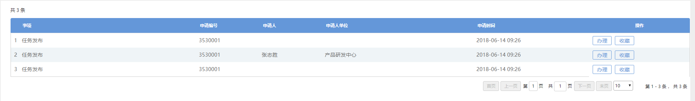

## 1. 修改流程
### 1.1 父流程  
添加审定,验收环节。
### 1.2 子流程  
去除审定验收环节，添加更改状态

## 2. 数据库改动  
### 2.1 增加表  
增加子流程表，保存子流程信息

---

## 3. 状态更改
### 1. 发布
1.1 未发布
- 任务待发布
    `pre_publish`

1.2 已发布
- 待预审
    `pre_review`
### 2. 预审  
2.1 预审通过
- 子任务状态为待领取,主任务为待反馈
    `pre_receive`
    `pre_feedback`

2.2 审批不通过
- 返回任务发布

### 3. 任务记录  
3.1 审批通过
- 领取后改为汇报中
    `pre_reporting`
- 汇报后进度为100，主任务子任务状态改为待审定
    `pre_verified`
### 4. 审定
4.2审定通过
- 主任务,子任务改为待验收  
    `pre_accept`

4.1 审定不通过
- 子任务进度改为0,子任务状态改为待汇报,主任务改为待审定
    `sub_report` 待汇报
    `pre_verified` 待审定

### 5. 验收  
5.1 验收通过
- 主任务状态改为竣工,子任务状态已完成、进度为100
    `task_complete` 竣工
    `sub_completed` 已完成
5.2 验收不通过
- 子任务状态为待汇报，进度为0，

###### 6.已知BUG
1. 任务多发布-发布一个任务,如果有多个审定,即产生多个流程
1. 保存提交,产生多个审定任务,验收.
 
2. 审批查看时任务显示.(可解决)
3. 所有过程中任务发布表中的任务状态都未修改成功
